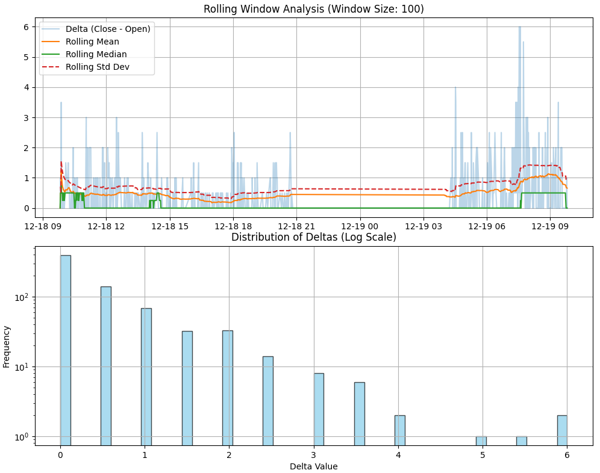
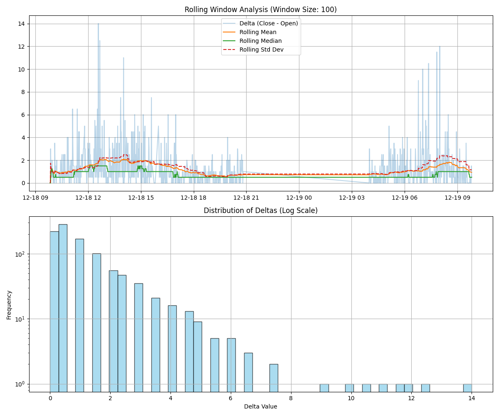
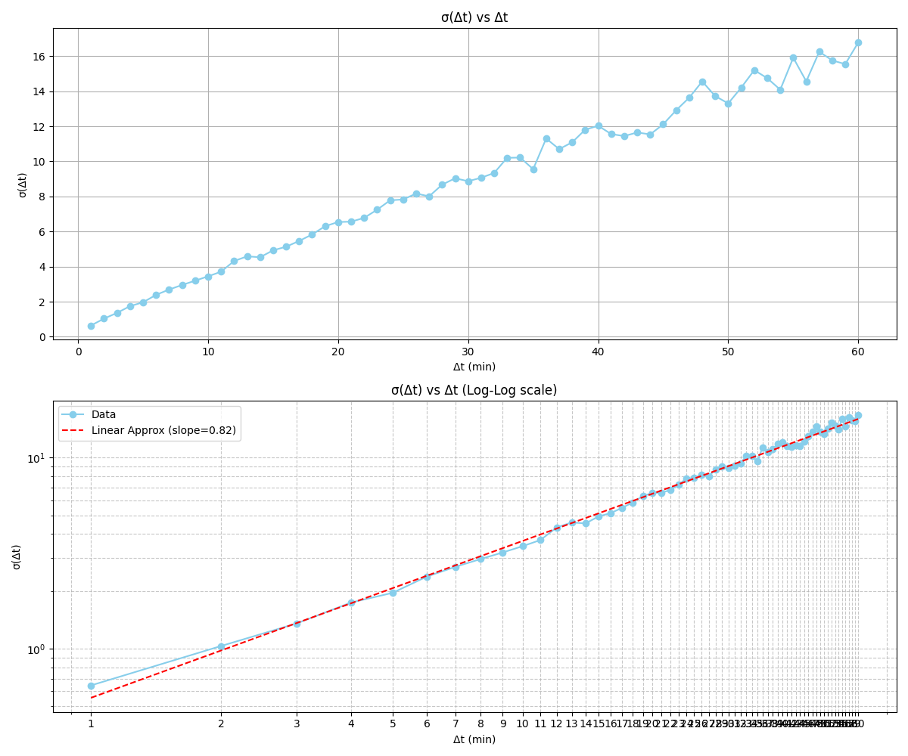
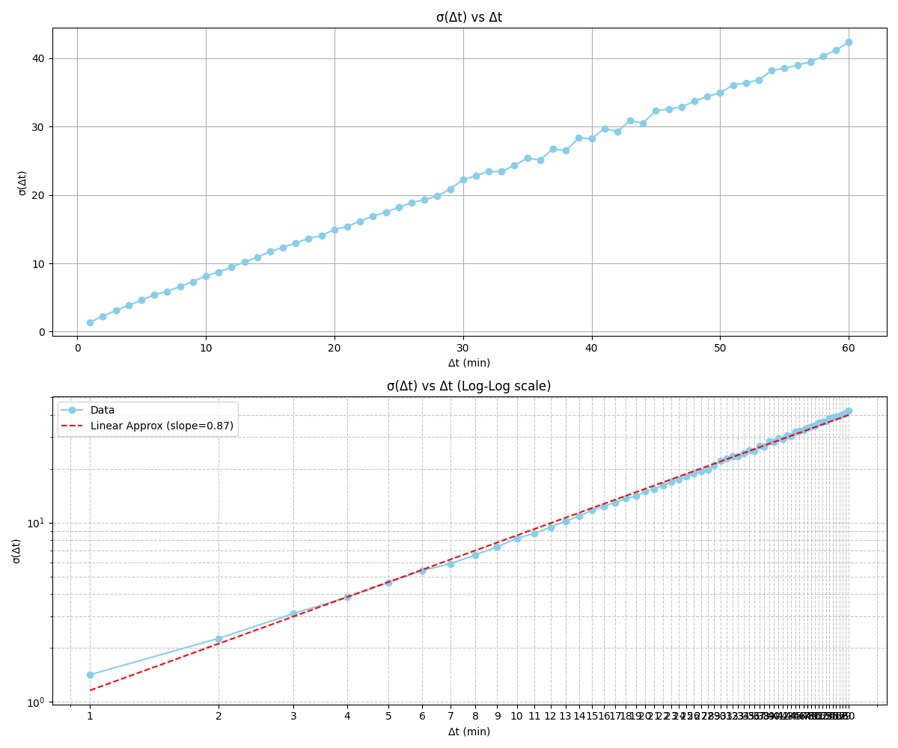

# median-approximation

Median approximation on market candles needed for one of my other projects.

Notes (dev diary i guess):

1. As for now, I have no working algorythm for calculating median in $O(1)$. But I noticed that, if I plot deltas in a histogram, it resembles a power law. Needs futher research.

2. I've figured out that power laws are inseparable from fractals. Need to calculate Hurst koefficient for deltas.

3. Hurst exponent is approaching to 0.9 in some instruments. Need to document data.

# Theory (LLM)

# Attachments

1. - LENT:
     

   - OZON:
     

   > Distributions are influenced by liquidity of an instrument. OZON is more liquid and it also has more values in histogram.

2. - LENT. Herst koeff: 0.82
     
   - OZON. Herst koeff: 0.87
     
